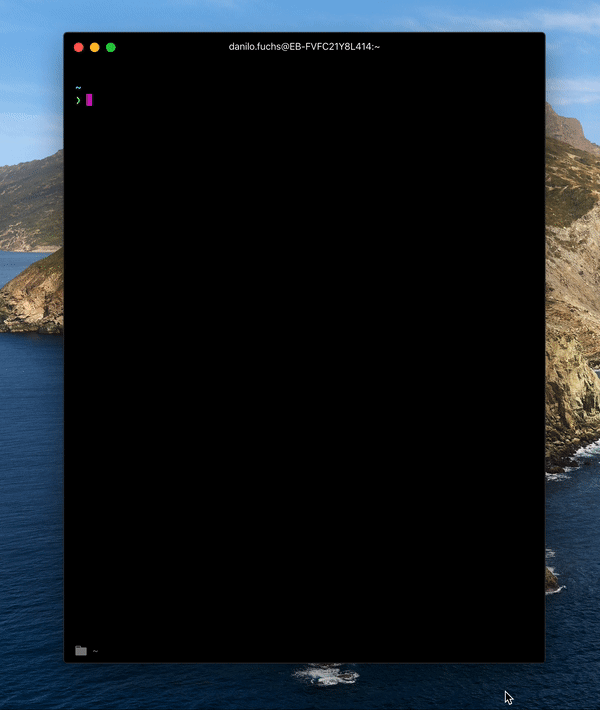

## `flutter pug get`



Ever written `flutter pug get` instead of `flutter pub get`?

Use this to start do get what you really need.

### Installation

```bash
git clone https://github.com/danilofuchs/pug ~/pug
```

Add this line to your `.zshrc` or `.bash_profile`:

```bash
export PUG_PATH="$HOME/pug"
. "$PUG_PATH/pug.sh"
```

### Generating ASCII image

I used [tzvetkoff/im2a](https://github.com/tzvetkoff/im2a):

```
im2a --width=80 --pixel pug.png > pug.txt
```
